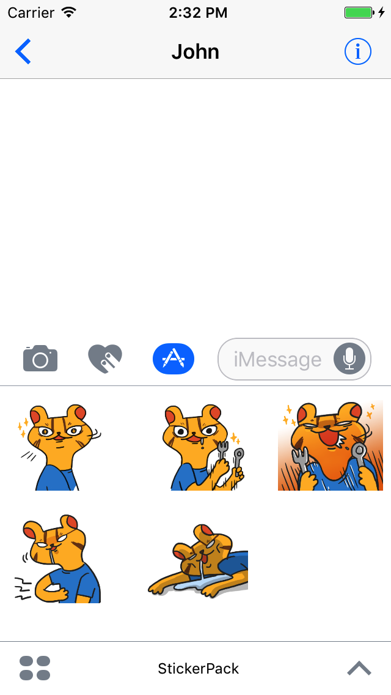
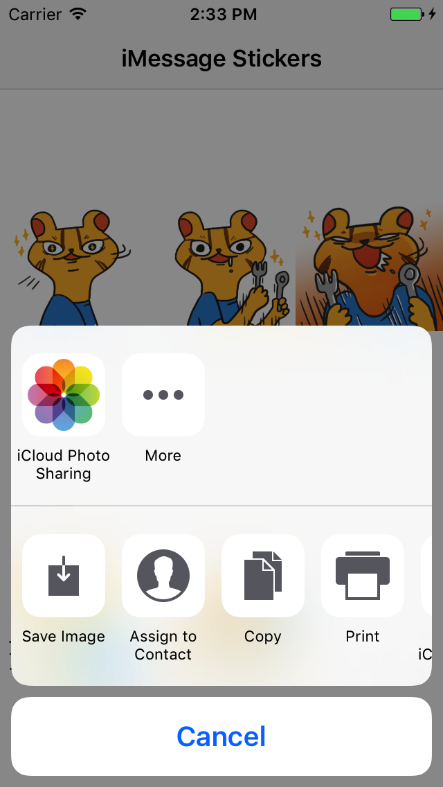

# iMessage Sticker Pack

## Usage

Clone the repository

`git clone git@github.com:nimbl3/imessage-stickers.git`

And run!

## Sticker Pack

## Main App

## About

This project is maintained and funded by Nimbl3 Ltd.

We love open source and do our part in sharing our work with the community!
See [our other projects][community] or [hire our team][hire] to help build your product.

[community]: https://github.com/nimbl3
[hire]: https://nimbl3.com/
